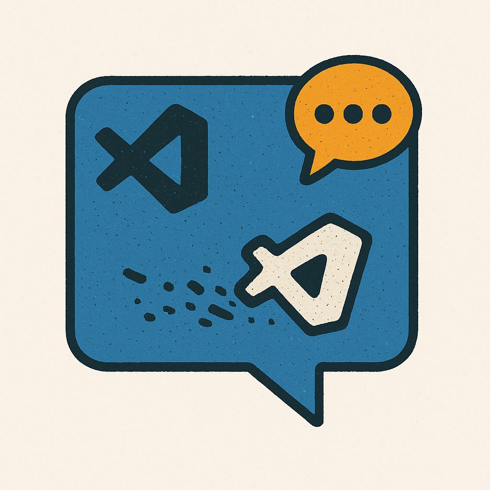

# Dust IRC [](https://github.com/nocandefense/dustirc/actions/workflows/ci.yml) [](https://codecov.io/gh/nocandefense/dustirc)



Dust is a functional IRC client for Visual Studio Code that provides essential IRC functionality with a focus on simplicity and integration with your coding workflow.

## Features

- **Webview Chat Interface** - Modern chat UI with channel tabs, message history, and input field
- **Real IRC connectivity** with TLS support for secure connections
- **Channel management** - join, leave, and navigate IRC channels
- **Message sending** with proper channel targeting and rate limiting
- **Auto-registration** with IRC servers using NICK/USER commands
- **Connection management** with auto-reconnect capability and PING/PONG keepalive
- **Status bar integration** showing connection state and current channel
- **Message logging** with structured output and workspace file logging
- **Ping/RTT monitoring** for connection health
- **Command palette fallback** - All features accessible without webview

## Quick Start

1. Install the extension in VS Code
2. Open the Command Palette (`Cmd/Ctrl+Shift+P`)
3. Run `IRC: Connect` to connect to an IRC server
4. The chat interface opens automatically (or use `IRC: Open Chat`)
5. Click channel tabs to switch between conversations
6. Type messages in the input field and press Enter or click Send
7. Alternatively, use Command Palette commands for all operations

## Available Commands

All commands are available through the Command Palette (`Cmd/Ctrl+Shift+P`):

- **`IRC: Open Chat`** - Open the webview chat interface (primary UI)
- **`Dust: Connect`** - Connect to an IRC server (prompts for host, port, nickname, username)
- **`Dust: Join Channel`** - Join an IRC channel (e.g., `#example`)
- **`Dust: Leave Channel`** - Leave the current channel or select from joined channels
- **`Dust: Say...`** - Send a message to the current channel (command palette alternative)
- **`Dust: Say to Channel...`** - Send a message to a specific channel
- **`Dust: Ping`** - Check connection health with round-trip time
- **`Dust: Reconnect`** - Manually reconnect to the last server
- **`Dust: Disconnect`** - Disconnect from the current server
- **`Dust: Identify with NickServ`** - Authenticate with NickServ
- **`Dust: Open Output`** - View the IRC activity log
- **`Dust: Open Room`** - Navigate to a specific channelast server
- **`Dust: Open Output`** - View the IRC activity log

## Connection Details

When connecting, you'll be prompted for:

- **Host**: IRC server hostname (e.g., `irc.libera.chat`)
- **Port**: Server port (`6667` for plaintext, `6697` for TLS)
- **Nickname**: Your IRC nickname
- **Username**: Your IRC username (defaults to nickname)

The client automatically detects TLS requirements for common SSL ports (6697, 6670) and handles server registration automatically.

## Status Bar

The status bar shows your connection state:

- `Dust: disconnected` - Not connected to any server
- `Dust: connected` - Connected but not in any channels  
- `Dust: #channelname` - Connected and active in a channel

## Settings

Access these settings through VS Code Settings (`Cmd/Ctrl+,`) or in your `settings.json`:

### Connection Settings

- **`dustirc.autoReconnect`** (boolean, default: `true`): Automatically reconnect when connection is lost
- **`dustirc.connection.defaultHost`** (string): Default IRC server hostname
- **`dustirc.connection.defaultPort`** (number, default: `6697`): Default IRC server port
- **`dustirc.connection.defaultNickname`** (string): Default IRC nickname
- **`dustirc.connection.defaultUsername`** (string): Default IRC username
- **`dustirc.connection.timeout`** (number, default: `10000`): Connection timeout in milliseconds
- **`dustirc.connection.forceTLS`** (boolean, default: `false`): Always use TLS connections

### User Interface Settings

- **`dustirc.ui.useWebview`** (boolean, default: `true`): Use webview chat interface (disable for command palette only)
- **`dustirc.ui.showInStatusBar`** (boolean, default: `true`): Show status in status bar
- **`dustirc.ui.createOutputChannels`** (boolean, default: `true`): Create separate output channels
- **`dustirc.ui.autoOpenOutput`** (boolean, default: `true`): Auto-open output on messages

### Channel Settings

- **`dustirc.channels.autoJoin`** (array): Channels to auto-join on connect (e.g., `["#general", "#dev"]`)

### Messaging Settings

- **`dustirc.messaging.logToFile`** (boolean, default: `true`): Log messages to workspace file
- **`dustirc.messaging.sendRateLimit`** (number, default: `200`): Rate limit for sending messages (ms)

### Example Configuration

```json
{
  "dustirc.connection.defaultHost": "irc.libera.chat",
  "dustirc.connection.defaultPort": 6697,
  "dustirc.connection.defaultNickname": "myuser",
  "dustirc.autoReconnect": true,
  "dustirc.channels.autoJoin": ["#general", "#programming"],
  "dustirc.ui.autoOpenOutput": true
}
```

## Features in Action

- ✅ **Settings-driven defaults**: Connection prompts pre-filled with your preferences
- ✅ **Auto-reconnect with retry logic**: Configurable attempts and delays
- ✅ **Auto-join channels**: Automatically join your favorite channels on connect
- ✅ **Customizable UI**: Control status bar display, output channel behavior
- ✅ **Smart message logging**: Optional file logging with timestamp tracking
- ✅ **Connection timeout**: Configurable timeout for network connections
- ✅ **Force TLS**: Override automatic TLS detection

## Message Flow

1. Connect to an IRC server using `Dust: Connect`
2. Join a channel with `Dust: Join Channel` - this becomes your "current channel"
3. Send messages with `Dust: Say...` - messages go to your current channel
4. View all IRC activity in the Output panel via `Dust: Open Output`
5. Outgoing messages are logged to `.vscode/dust-outgoing.log` in your workspace

## Development setup

After cloning, install dependencies and prepare Husky hooks:

```bash
npm ci
npm run prepare
```

This will install dev hooks (Husky) so that staged files are auto-fixed by `lint-staged` on commit.

## Run & test

Run the extension's test suite and build locally:

```bash
npm run compile
npm test
```

To run the extension in the VS Code debugger, open this folder in VS Code and use the "Run Extension" launch configuration.

## Publishing

To publish the extension to the VS Code Marketplace you'll typically:

1. Bump the version in `package.json`.
2. Build the extension with `npm run compile`.
3. Create a VSIX and publish with `vsce` or the `@vscode/vsce` CLI.

Example (local):

```bash
npm run compile
npx vsce package
# then publish using vsce or through the Marketplace web UI
```

## Contributing

See `CONTRIBUTING.md` for development setup and contribution guidelines. In short:

- Run `npm ci` then `npm run prepare` to enable Husky git hooks locally.
- The repo includes a pre-commit hook that runs `lint-staged` to auto-fix staged files.

## Running tests

Run the test suite locally with:

```bash
npm test
```

## Known Issues

There are no known issues at this time. If you find a bug, please open an issue on the repository.

## Release Notes

See `CHANGELOG.md` for release notes and version history.

## Following extension guidelines

Ensure that you've read through the extensions guidelines and follow the best practices for creating your extension.

- [Extension Guidelines](https://code.visualstudio.com/api/references/extension-guidelines)

## Working with Markdown

You can author your README using Visual Studio Code. Here are some useful editor keyboard shortcuts:

- Split the editor (`Cmd+\` on macOS or `Ctrl+\` on Windows and Linux).
- Toggle preview (`Shift+Cmd+V` on macOS or `Shift+Ctrl+V` on Windows and Linux).
- Press `Ctrl+Space` (Windows, Linux, macOS) to see a list of Markdown snippets.

## For more information

- [Visual Studio Code's Markdown Support](http://code.visualstudio.com/docs/languages/markdown)
- [Markdown Syntax Reference](https://help.github.com/articles/markdown-basics/)

**Enjoy!**
